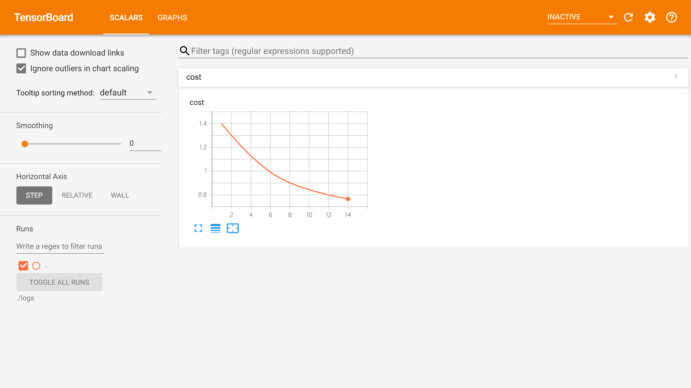

# 모델 재사용
## 학습 모델 저장과 재사용
지난 파트에서 사용했던 신경망 모델을 써서 학습 모델 저장과 재사용을 배워보자.
~~~
털, 날개, 기타, 포유류, 조류
0, 0, 1, 0, 0
1, 0, 0, 1, 0
1, 1, 0, 0, 1
0, 0, 1, 0, 0
0, 0, 1, 0, 0
0, 1, 0, 0, 1
~~~
위 내용을 data.csv에 저장했다.

1,2열은 특징값이고, 3~5열은 개체의 종류를 나타내는 데이터이다.

위 데이터를 아래 코드로 쉽게 언팩할 수 있다.
~~~python
data = np.loadtxt('./data.csv', delimiter=',',unpack=True, dtype='float32')

x_data = np.transpose(data[0:2])
y_data = np.transpose(data[2:])
~~~

`modelSaver.py`를 보면 아래 코드를 찾을 수 있을 것이다.
~~~python
saver = tf.train.Saver(tf.global_variables())
~~~
`tf.global_variables()`는 앞서 정의한 변수들을 가져오는 함수이다.

이렇게 변수들을 가져와서, 이후 이 변수들을 파일에 저장하거나 이전에 학습한 결과를 불러오는 변수로 사용한다.

~~~python
#존재하는 모델 체크
ckpt = tf.train.get_checkpoint_state('./model')
if ckpt and tf.train.checkpoint_exists(ckpt.model_checkpoint_path):
    saver.restore(sess, ckpt.model_checkpoint_path)
else:
    sess.run(tf.global_variables_initializer())
~~~
이렇게 존재하는 모델을 가져와서 다시 쓸 수 있다.

## 텐서보드
텐서플로우는 학습 과정에서의 손실값이나 정확도 등을 편하게 볼 수 있도록 텐서보드라는 시각화 툴을 제공한다.
몇 줄의 코드만 코드에 넣으면 사용가능하다!

`tensorBoard.py`를 참고하라!

적절하게 로그를 저장했다면 아래  명령어를 터미널에 넣어보자.
~~~
tensorboard --logdir=./logs
~~~

이제 로컬호스트의 6006 포트로 들어가서 확인하면 된다.

ㅅㅌㅊ

각 가중치와 편향의 변화를 그래프로 보고 싶다면 다음 코드를 넣고 학습을 진행하면 된다.

~~~python
tf.summary.histogram("Weights", W1)
~~~