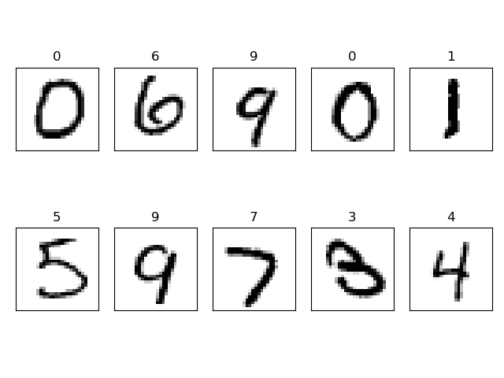

# 딥러닝 MNIST
[MNIST](http://yann.lecun.com/exdb/mnist/)를 할 줄 알아야 딥러닝을 할 줄 안다 할 수 있다 이말이야!

통상적으로 데이터를 한번에 많이 학습시키는게 좋지만, 성능의 한계가 있어 조금씩 잘라서 가르쳐야 한다.
이런 걸 미니배치라고 한다.

## 과적합
신경망을 늘리고 학습을 여러번 시키면 보통 성능이 오르지만, 때로는 과적합(overfitting) 문제가 발생하기도 한다.

과적합이란, 학습에 사용된 데이터는 아주 높은 확률로 정답을 맞추지만, 이외의 실제 데이터로는 오류율이 아주 높아지는 경우이다.

## 에포크
데이터 셋 전체를 1회 학습하는 것을 에포크(epoch)라 한다.

정확성을 위해 보통 전체 데이터셋을 여러번 학습시킨다.

## 드롭아웃
같은 데이터로 여러 차례 학습을 반복하면, 이윽고 신경망이 학습데이터에만 최적화되는 오버피팅이 일어난다.

이를 방지하기 위한 가장 간단하고 효과적인 방법이 드롭아웃이다.

학습 과정에서 일부 뉴런을 의도적으로 사용하지 않음으로써 특정 뉴런으로 기울기가 고정되는 것을 막아 가중치의 균형을 잡는다.

드롭아웃은 아래처럼 간단히 구현할 수 있다.

~~~python
W1 = tf.Variable(tf.random_normal([784,256], stddev=0.01))#표준편차 0.01 정규분포
L1 = tf.nn.relu(tf.matmul(X,W1))
L1 = tf.nn.dropout(L1, 0.8)#학습 시, 80%의 뉴런만 사용
~~~

## 배치 정규화
오버피팅을 막는 또 하나의 방법으로 배치 정규화(Batch Nomalization)가 있다.

이 기법은 학습 속도도 향상시켜주는 장점이 있으나, 모델별로 적합한 오버피팅 방지법이 있으니 남용은 자제하자.

~~~python
tf.layers.batch_normalization(L1, training=is_training)
~~~

## 결과
pyplot으로 예쁘게 결과를 출력해봤다.

와!