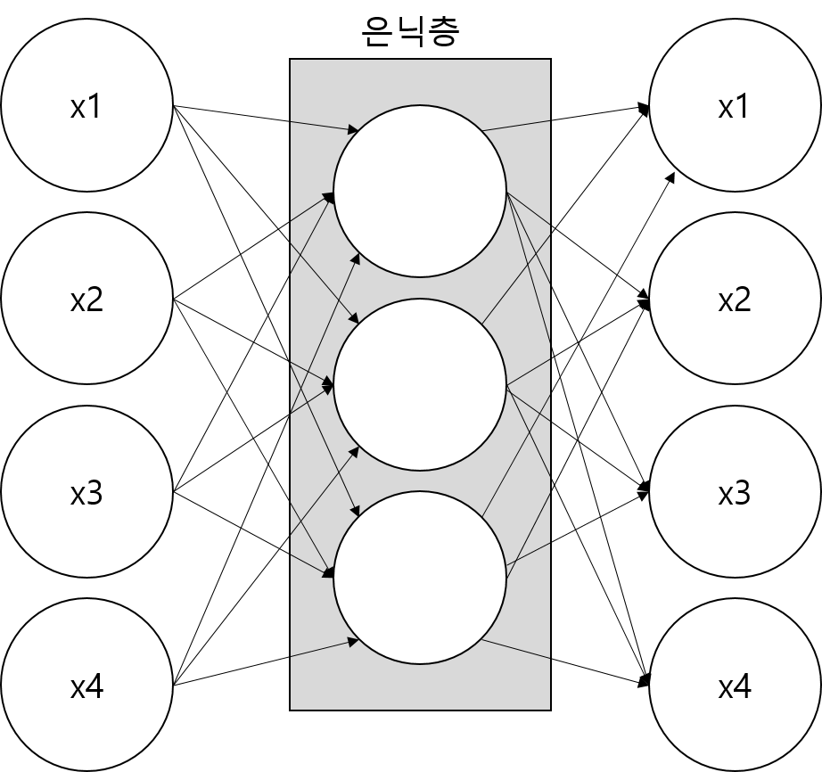
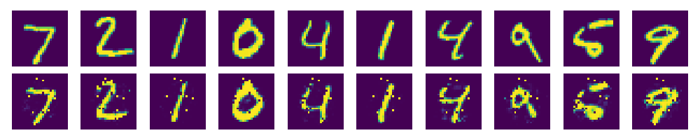
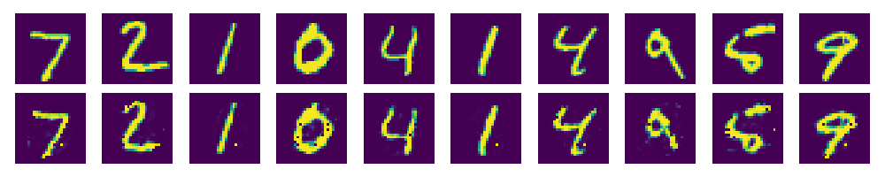

# Autoencoder
## 지도 학습과 비지도 학습
머신러닝 학습 방법은 크게 지도 학습(Supervised Learning)과 비지도 학습(Unsupervised Learning)으로 나뉜다.

지도 학습은 프로그램에게 원하는 결과를 알려주고 학습하게 하는 방법이고, 비지도 학습은 입력값으로부터 데이터의 특징을 찾아내는 학습 방법이다.

즉, 지도 학습은 X와 Y 모두가 필요한 반면, 비지도 학습에서는 X 값만 있으면 되는 것이ㅏㄷ.

이러한 비지도 학습법 중 널리 쓰이는 신경망으로 오토인코더가 있다.

## 오토인코더
오토인코더는 입력값과 출력값이 같게 하는 신경망으로, 은닉층의 노드 수가 입력값보다 적은 것이 특이한 점이다. 이러한 구조로 인해 입력 데이터를 압축하는 효과를 얻게 되고, 이 과정이 노이즈 제거에 매우 효과적이다.

오토인코더의 핵심은 입력층으로 들어온 데이터를 인코더를 통해 은닉층으로 보냈다가 다시 디코드하여 출력하는 과저엥서 출력값이 입력값과 가장 비슷해지게 만드는 가중치를 찾아내는 것이다.

오토인코더에는 변이형 오토인코더(Variational Autoencoder), 잡음제거 오토인코더(Denoising Autoencoder) 등 다양한 방식이 있다.

### 실습
`autoencoder.py`에 실제 오토인코더 신경망을 구현해보았다.

위가 원본이고 아래가 인코딩과 디코딩을 거친 이미지 이다.

학습을 대충 했는데도 꽤나 정확한 모습이다.

cost가 0.015까지 떨어진 후에 출력한 이미지다 위 사진보다도 확연하게 노이즈가 줄어든 것을 알 수 있다.