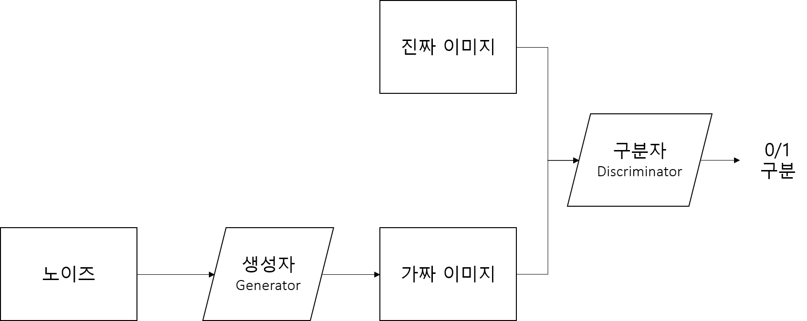
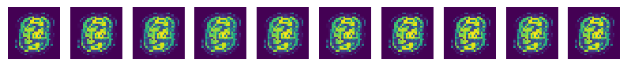
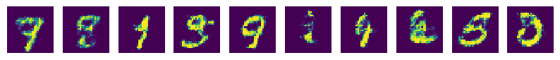

# GAN
2016년 화제가 된 Generative Adversarial Network(GAN)는 직역하면 생산적 대립 신경망을 뜻한다.

2014년 GAN을 제안한 이안 굿펠로우의 비유를 인용하자면, 위조지폐범(생성자)과 경찰(구분자)가 있는데, 위조지폐범은 최대한 경찰을 속이려고 노력하고 경찰은 최대한 이를 감별하려 노력하는 것이다.

이러한 경찰과 위조지폐범의 대립속에서 이들은 서로 발전하고, 결국은 진짜와 구분할 수 없는 위조지폐가 탄생한다는 것이다.

## 구현
GAN의 기본구조를 살펴보면 아래와 같다.

먼저, 구분자에게 실제 이미지를 입력하고 이미지의 진위를 구분하도록 학습시킨다. 이후 생성자를 통해 노이즈로부터 가짜 이미지를 생성하게 하고, 이것을 다시 구분자에게 검증하게 하는 것이다.

생성자는 가능한 구분자를 잘 속이게 훈련하고, 구분자는 가능한 진위를 잘 구분하도록 학습시키는 것이 GAN의 핵심이다.

## MNIST-Generator
GAN을 활용한 MNIST 손글씨 Generator를 만들었다.

samples 디렉토리를 보면 10번의 epoch마다 개선되어가는 가짜 이미지를 확인할 수 있다.

가장 첫 세대와 100번째 학습에서 생성된 이미지다. 제법 그럴 듯한 숫자를 만드는 모습이다.

