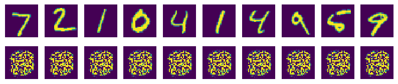
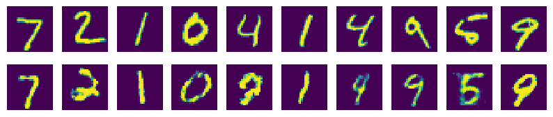

# GAN
2016년 화제가 된 Generative Adversarial Network(GAN)는 직역하면 생산적 대립 신경망을 뜻한다.

2014년 GAN을 제안한 이안 굿펠로우의 비유를 인용하자면, 위조지폐범(생성자)과 경찰(구분자)가 있는데, 위조지폐범은 최대한 경찰을 속이려고 노력하고 경찰은 최대한 이를 감별하려 노력하는 것이다.

이러한 경찰과 위조지폐범의 대립속에서 이들은 서로 발전하고, 결국은 진짜와 구분할 수 없는 위조지폐가 탄생한다는 것이다.

## 구현
GAN의 기본구조를 살펴보면 아래와 같다.

먼저, 구분자에게 실제 이미지를 입력하고 이미지의 진위를 구분하도록 학습시킨다. 이후 생성자를 통해 노이즈로부터 가짜 이미지를 생성하게 하고, 이것을 다시 구분자에게 검증하게 하는 것이다.

생성자는 가능한 구분자를 잘 속이게 훈련하고, 구분자는 가능한 진위를 잘 구분하도록 학습시키는 것이 GAN의 핵심이다.

## MNIST-Generator
GAN을 활용한 MNIST 손글씨 Generator를 만들었다.

samples 디렉토리를 보면 10번의 epoch마다 개선되어가는 가짜 이미지를 확인할 수 있다.

가장 첫 세대와 100번째 학습에서 생성된 이미지다. 제법 그럴 듯한 숫자를 만드는 모습이다.

## MNIST-GeneratorV2
이번에는 내가 지정한 숫자를 생성하는 generator를 만들어보자. 

코드도 TF의 고급 기능들을 활용하여 세련되게 개선하였다.

이번에는 generator에 노이즈 외에도 원하는 숫자를 힌트로 주는 label을 함께 입력한다.

samples2 디렉토리에서 이번에도 예시를 볼 수 있다.

위 이미지는 원래 MNIST에 존재하는 데이터이고, 아래는 생성된 숫자이다.

## 생각해 볼 것
프로그램을 실행했을 때, discriminator의 학습은 비교적 빨리 0.x 때의 손실율을 찾는 방면, generator는 2.x 대로 둘의 학습 속도가 상이함을 알 수 있었다.

대규모의 프로젝트를 진행할 때는, 둘의 학습을 따로 시켜야 한 신경망이 overfitting 되는 것을 막을 수 있을 것이다.

## 더 나아가기
Part 8에 들어서기 앞서, 복습 겸 활용 차원에서 Part 7.5에서는 이 GAN 모델을 Saver를 활용하여 저장하고, 생성자와 구분자를 CNN으로 구현한 모델을 만들어 볼 것이다.