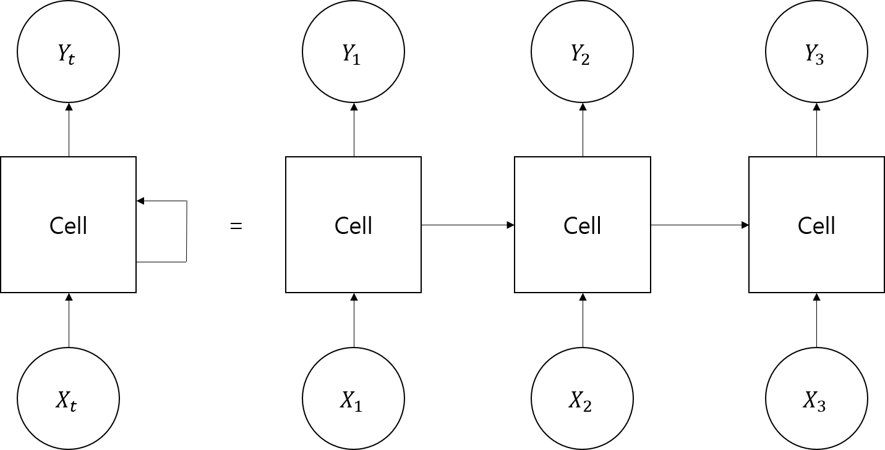

# 순환신경망
Recurrent Neural Network(RNN)은 자연어 처리나 음성 인식과 같은 순서가 있는 데이터를 처리하는데강한 신경망이다.

위와 같이 신경망이 데이터를 처리할 때, 이번에 입력된 값 이외에 지난 단계에 입력된 값을 함께 사용하여 문맥이나 연속성을 파악한다.

먼저 익숙한 MNIST로 RNN 실습을 해보았다. `MNISTwithRNN.py`를 보라.

## LSTM과 GRU
기본 RNN 셀은 입력된 데이터가 길어지면, 뒤쪽에서 맨 앞쪽의 데이터를 잘 기억하지 못하는 단점이 있다.

그래서 이를 개선한 LSTM(Long Short-Term Memory)이나 GRU(Gated Recurrent Unit) 신경망이 등장했다.

## 단어 자동 완성 만들기
영문자 4글자로 구성된 단어를 학습시켜, 3글자를 입력하면 자동완성을 추천하는 프로그램을 만들어 보자.

참고로 dynamic_rnn의 sequence_length 옵션을 사용하면 가변 길이 단어를 학습시킬 수 있다.

짧은 단어의 빈 자리만큼 뒷 부분을 0으로 채우고 해당 단어 길이를 계산해 sequence_length로 넘겨주면 된다.

## Seq2Seq
더 나아가서 Seq2Seq를 배우면 좋다.